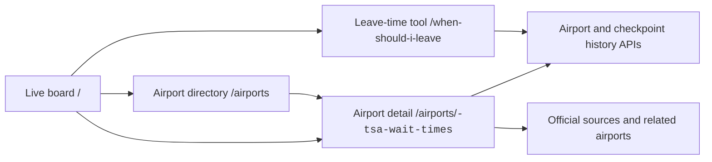

# Wayfinding Atlas Redesign

## Goal

Make TSA Tracker feel like a calm airport wayfinding utility: fast to scan, explicit about source quality, and focused on the travel decision rather than marketing chrome.

## Research Inputs

The direction is based on the Website Master Builder knowledge base:

- `/Users/benbirkhahn/website-master-builder/knowledge/design-rules.md`
- `/Users/benbirkhahn/website-master-builder/knowledge/anti-patterns.md`
- `/Users/benbirkhahn/website-master-builder/knowledge/patterns.md`
- `/Users/benbirkhahn/website-master-builder/knowledge/interaction-patterns.md`
- `/Users/benbirkhahn/website-master-builder/knowledge/examples/design-systems/govuk.md`
- `/Users/benbirkhahn/website-master-builder/knowledge/motion/accessibility-rules.md`
- `/Users/benbirkhahn/website-master-builder/workflows/05-design-system.md`
- `/Users/benbirkhahn/website-master-builder/workflows/07-qa-launch.md`

Incomplete animation-example stubs were excluded from design decisions.

## Visual Thesis

- Warm paper background and navy ink evoke printed airport maps and operational signage.
- Safety orange marks primary emphasis and action.
- Green, amber, and red are reserved for wait and source semantics.
- Oswald carries airport codes, large waits, and display headlines.
- Space Grotesk carries interface and editorial copy.
- IBM Plex Mono carries source, freshness, status, and chart labels.
- Horizontal rules and table rows organize dense live data. Cards are reserved for genuinely framed tools or grouped guidance.

## Primary Journey

1. `/` starts with airport search and a live network snapshot.
2. The complete server-rendered board remains the primary proof and navigation surface.
3. `/airports/<code>-tsa-wait-times` puts current status, checkpoint comparison, the 30-day pattern, and timing guidance before editorial content.
4. `/when-should-i-leave` uses the same shell and turns live data into a departure recommendation.

## Terminal Decision Map Pilot

- LAS uses a server-rendered terminal schematic that maps gates to the five checkpoints published by the airport.
- Four nodes consume the existing live checkpoint rows; the Innovation checkpoint remains informational because the live feed does not publish it separately.
- Gate, lane, and check-in-terminal controls identify the fastest compatible live reading without changing URLs or data APIs.
- Missing checkpoint rows are labeled `No live reading`; a reported zero remains `0 min` and is never inferred to mean closed.
- The raw checkpoint feed stays available below the schematic for auditing and graceful fallback.

## Contracts That Must Not Change

- Render airport links from `a.href` and related links from `r.href`.
- Keep canonical airport URLs at `/airports/<lowercase-code>-tsa-wait-times`.
- Keep home hooks `#q`, `#board`, `.row`, `.sorts button`, and all row `data-*` attributes.
- Keep airport chart hooks `#chart`, `#chart-tooltip`, `#pattern-tools`, `#pattern-airport-btn`, `#pattern-checkpoint-btn`, `#checkpoint-pattern-select`, and `#pattern-insight`.
- Keep the two history calls:
  - `/api/history-24h-average?airport=CODE&days=30`
  - `/api/checkpoint-history-24h-average?airport=CODE&days=30`
- Keep SEO, canonical, Open Graph, structured breadcrumb, analytics, advertising, and affiliate includes.
- Do not wire in `static/app.js`; production templates do not currently use its obsolete DOM contract.

## Responsive And Accessibility Rules

- Keep live versus estimated source labels visible on mobile.
- Preserve one `h1` per route and semantic heading order.
- Use visible keyboard focus states for every interactive control.
- Expose selected sort and chart scope with `aria-pressed`.
- Do not hide critical data behind hover or animation.
- Reduce all nonessential motion under `prefers-reduced-motion`.
- Maintain minimum 44-pixel practical touch targets for primary mobile controls.

## Validation

- `python3 -m pytest -q`
- `ENABLE_POLLER=false DB_PATH=/tmp/tsa-redesign-seo.db python3 scripts/seo_smoke_check.py`
- Parse `static/tracker.css` and `static/style.css` with `tinycss2`.
- Render all canonical airport pages and confirm both history API URLs remain present.
- Syntax-check rendered inline JavaScript with `node --check`.
