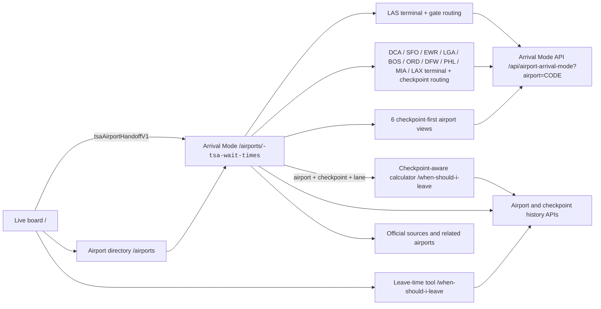

# Wayfinding Atlas Redesign

## Goal

Make TSA Tracker feel like a calm airport wayfinding utility: fast to scan, explicit about source quality, and focused on the travel decision rather than marketing chrome.

## Research Inputs

The direction is based on the Website Master Builder knowledge base:

- `/Users/benbirkhahn/website-master-builder/knowledge/design-rules.md`
- `/Users/benbirkhahn/website-master-builder/knowledge/anti-patterns.md`
- `/Users/benbirkhahn/website-master-builder/knowledge/patterns.md`
- `/Users/benbirkhahn/website-master-builder/knowledge/interaction-patterns.md`
- `/Users/benbirkhahn/website-master-builder/knowledge/examples/design-systems/govuk.md`
- `/Users/benbirkhahn/website-master-builder/knowledge/motion/accessibility-rules.md`
- `/Users/benbirkhahn/website-master-builder/workflows/05-design-system.md`
- `/Users/benbirkhahn/website-master-builder/workflows/07-qa-launch.md`

Incomplete animation-example stubs were excluded from design decisions.

## Visual Thesis

- Warm paper background and navy ink evoke printed airport maps and operational signage.
- Safety orange marks primary emphasis and action.
- Green, amber, and red are reserved for wait and source semantics.
- Oswald carries airport codes, large waits, and display headlines.
- Space Grotesk carries interface and editorial copy.
- IBM Plex Mono carries source, freshness, status, and chart labels.
- Horizontal rules and table rows organize dense live data. Cards are reserved for genuinely framed tools or grouped guidance.

## Primary Journey

1. `/` starts with airport search and a live network snapshot.
2. The complete server-rendered board remains the primary proof and navigation surface.
3. `/airports/<code>-tsa-wait-times` puts current status, checkpoint comparison, the 30-day pattern, and timing guidance before editorial content.
4. `/when-should-i-leave` uses the same shell and turns live data into a departure recommendation.

## Network-wide Airport Arrival Mode

- Every tracked airport uses the progressively enhanced satellite arrival canvas. LAS retains trustworthy Terminal 1 and Terminal 3 anchors plus gate compatibility because it has a reviewed routing model.
- DCA uses three reviewed checkpoint-area anchors. SFO uses five reviewed terminal-building anchors and groups six published checkpoints beneath them. EWR groups five readings under Terminals A, B, and C; LGA maps its Terminal B and C readings. BOS groups seven named checkpoints under Terminals A, B, C, and E; ORD groups its terminal-level feed under Terminals 1, 2, 3, and 5. DFW maps all five terminals and its 15 named checkpoint areas; PHL maps six terminal/checkpoint areas, including its shared D/E entry. MIA groups its ten numbered checkpoints plus DFIS under North, Central, and South terminal complexes, with live values only where the feed supplies them. LAX maps eight terminal areas and treats non-TBIT checkpoints as published routing context because the official live page currently reports only TBIT. ATL maps five checkpoint areas under the Domestic and International terminals; CLT maps three checkpoint areas under the single terminal complex. All thirteen use terminal + checkpoint mode without inheriting LAS-specific gate rules.
- The other 4 tracked airports use checkpoint-first mode: one airport-overview anchor, official feed checkpoint labels, Standard/PreCheck comparison, and no invented terminal, gate, or indoor checkpoint geometry.
- At LAS, four checkpoints consume current lane readings; the Innovation checkpoint remains published-only because the live feed does not report it separately.
- LAS gate, lane, terminal, and checkpoint controls identify the fastest compatible fresh reading. Checkpoint-first airports compare the selected lane across all reporting checkpoints. Missing and stale readings fall back explicitly, while a provider-supplied zero remains `0 min` and is never inferred to mean closed.
- The homepage writes a short-lived `tsaAirportHandoffV1` session handoff before its cinematic fly-in. A matching airport page consumes it to preserve the satellite framing; direct visits start with the embedded arrival canvas.
- Arrival Mode links to a checkpoint-aware calculator URL. The calculator uses a selected `live` or `aging` lane reading and falls back to a labeled airport planning estimate for `stale`, `no_current_reading`, or `published_only` states.
- The raw checkpoint feed stays below Arrival Mode for auditing, no-JavaScript access, and graceful fallback.

## Contracts That Must Not Change

- Render airport links from `a.href` and related links from `r.href`.
- Keep canonical airport URLs at `/airports/<lowercase-code>-tsa-wait-times`.
- Keep home hooks `#q`, `#board`, `.row`, `.sorts button`, and all row `data-*` attributes.
- Keep airport chart hooks `#chart`, `#chart-tooltip`, `#pattern-tools`, `#pattern-airport-btn`, `#pattern-checkpoint-btn`, `#checkpoint-pattern-select`, and `#pattern-insight`.
- Keep the two history calls:
  - `/api/history-24h-average?airport=CODE&days=30`
  - `/api/checkpoint-history-24h-average?airport=CODE&days=30`
- Keep SEO, canonical, Open Graph, structured breadcrumb, analytics, advertising, and affiliate includes.
- Do not wire in `static/app.js`; production templates do not currently use its obsolete DOM contract.

## Responsive And Accessibility Rules

- Keep live versus estimated source labels visible on mobile.
- Preserve one `h1` per route and semantic heading order.
- Use visible keyboard focus states for every interactive control.
- Expose selected sort and chart scope with `aria-pressed`.
- Do not hide critical data behind hover or animation.
- Reduce all nonessential motion under `prefers-reduced-motion`.
- Maintain minimum 44-pixel practical touch targets for primary mobile controls.

## Validation

- `python3 -m pytest -q`
- `ENABLE_POLLER=false DB_PATH=/tmp/tsa-redesign-seo.db python3 scripts/seo_smoke_check.py`
- Parse `static/tracker.css` and `static/style.css` with `tinycss2`.
- Render all canonical airport pages and confirm both history API URLs remain present.
- Syntax-check rendered inline JavaScript with `node --check`.
